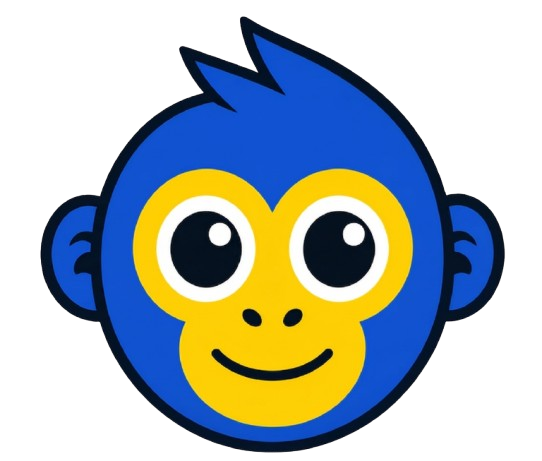
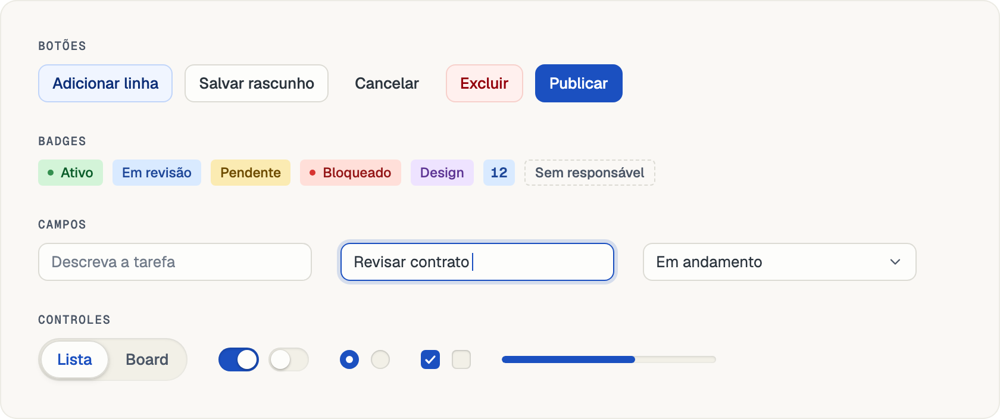
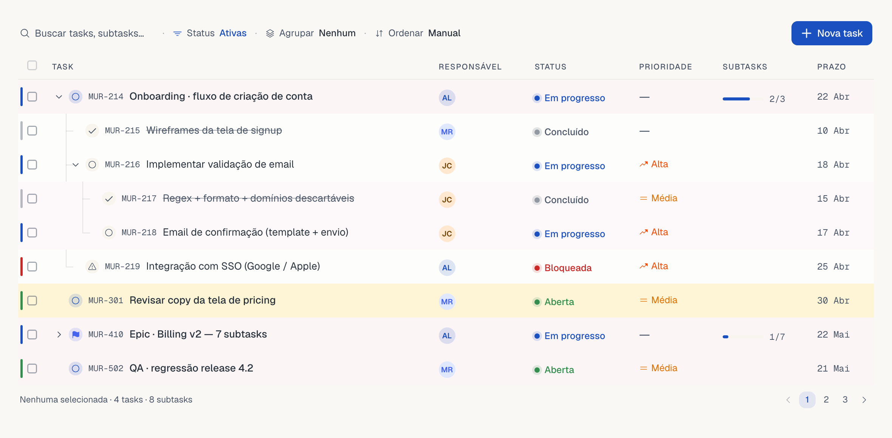
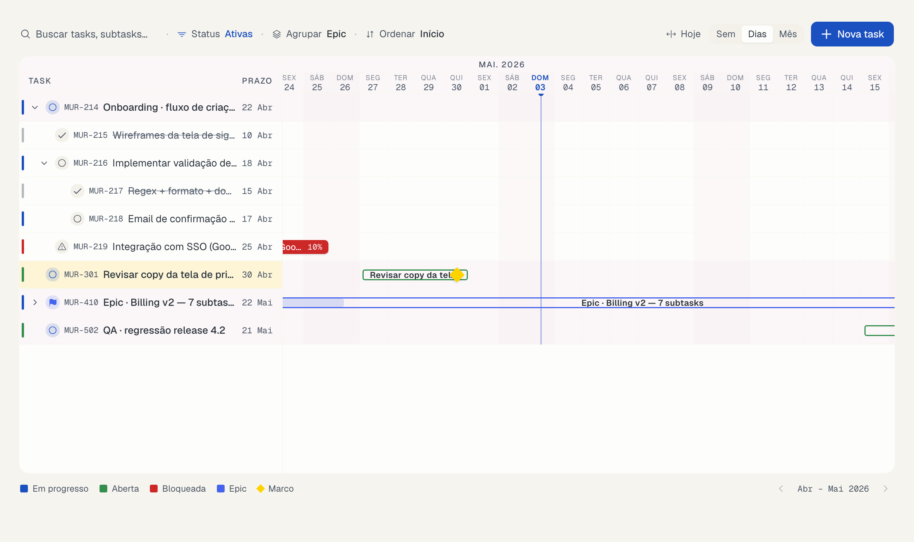
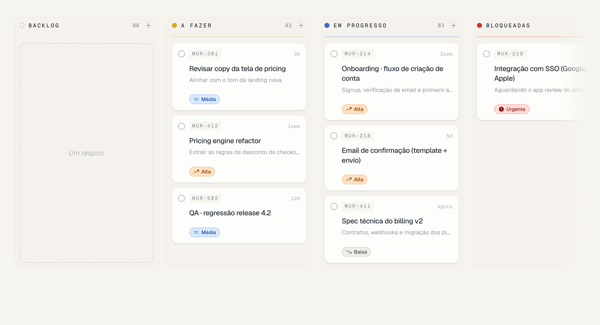
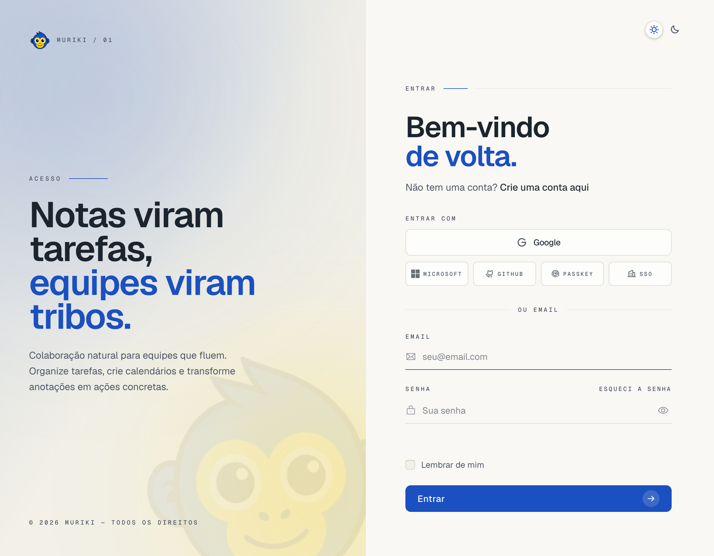

<p align="center">
  
</p>

<h1 align="center">Muriki Design System</h1>

<p align="center">Papel quente, tinta fria — o design system da Muriki.</p>

<p align="center">
  <picture>
    <source media="(prefers-color-scheme: dark)" srcset=".github/readme/vitrine-escura.png">
    
  </picture>
</p>

---

Duas metades que se alimentam:

| pasta | o que é |
| --- | --- |
| `design/` | as pranchas do canvas (`.dc.html`) e os generators que as produzem. É onde a decisão visual nasce e fica documentada. |
| `registry/` | os componentes de verdade, distribuídos como **registry do shadcn**. É o que entra no código. |
| `public/r/` | a saída do build — um `.json` por item, gerado pela Action e servido pelo Pages. É isso que o `shadcn add` consome. |

## Consumir

No projeto que vai instalar (ex.: `muriki-platform`), declare o registry em `components.json`:

```json
{
  "registries": {
    "@muriki": "https://swellsystem.github.io/muriki-ds/r/{name}.json"
  }
}
```

E instale:

```bash
bunx shadcn@latest add @muriki/button @muriki/badge @muriki/task-table @muriki/login-page
```

O `@muriki/theme` vem junto como dependência — ele injeta os tokens claro e escuro
no CSS do projeto e gera os mapeamentos `--color-*`, então `bg-tone-blue` e
`text-primary-subtle-foreground` passam a existir como classe do Tailwind.

## Exemplos

Botão — `outline` é o padrão; Base UI por baixo, então troca de elemento é
`render`, não `asChild`:

```tsx
import { Button } from "@/components/ui/button"

<Button>Salvar rascunho</Button>
<Button variant="primary">Adicionar linha</Button>
<Button variant="solid">Publicar</Button>              {/* exceção: uma por tela */}
<Button variant="ghost" size="icon" aria-label="Copiar"><Copy /></Button>
<Button variant="link" render={<a href="/planos" />}>Ver planos</Button>
<Button effect="wipe">Entrar com Google</Button>     {/* preenche da esquerda no hover */}
```

`effect` é um eixo à parte de `variant`: é como a peça reage ao ponteiro,
não o que ela é.

Badge — nove tons, e os três acessórios: ponto, contador e remoção. O
tracejado é o sinal de ausência do sistema:

```tsx
import { Badge } from "@/components/ui/badge"

<Badge tone="green" dot>Ativo</Badge>
<Badge tone="blue" count>12</Badge>
<Badge variant="dashed">Sem responsável</Badge>
<Badge tone="purple" onRemove={tirarFiltro} removeLabel="Remover filtro Design">Design</Badge>
```

ViewToggle — controlado, genérico sobre o tipo do valor, `ariaLabel`
obrigatório no tipo:

```tsx
import { ViewToggle } from "@/components/ui/view-toggle"

const [view, setView] = useState<"lista" | "board">("lista")

<ViewToggle
  value={view}
  onChange={setView}
  ariaLabel="Modo de visualização"
  options={[
    { value: "lista", label: "Lista" },
    { value: "board", label: "Board" },
  ]}
/>
```

RowActions — a linha precisa da classe `group/row` (é o hover dela que
revela a barra), e `label` é obrigatório em cada ação:

```tsx
import { RowActions } from "@/components/row-actions"

<tr className="group/row">
  {/* ...células... */}
  <td>
    <RowActions
      actions={[
        { id: "editar", label: "Editar", icon: PencilSimple, onSelect: editar, shortcut: "E" },
        { id: "duplicar", label: "Duplicar", icon: Copy, onSelect: duplicar },
        { id: "excluir", label: "Excluir", icon: Trash, onSelect: excluir, destructive: true },
      ]}
    />
  </td>
</tr>
```

Controles de formulário — Base UI, API controlada:

```tsx
<Switch checked={ativo} onCheckedChange={setAtivo} />
<Checkbox checked={selecionado} onCheckedChange={setSelecionado} indeterminate={parcial} />
<Progress value={62} />
```

Campo — o `Field` amarra label, controle, dica e erro por id e
`aria-describedby`. Não existe `useId` na mão:

```tsx
import { Field, FieldLabel, FieldDescription, FieldError } from "@/components/ui/field"
import { Input } from "@/components/ui/input"

<Field invalid={!!erro}>
  <FieldLabel>Título</FieldLabel>
  <Input placeholder="Descreva a tarefa" value={titulo} onValueChange={setTitulo} />
  <FieldDescription>Aparece na lista e no board.</FieldDescription>
  {erro ? <FieldError>{erro}</FieldError> : null}
</Field>
```

A variante `underline` do campo é a voz editorial — só o fio de baixo, para
tela de entrada. `variant="editorial"` no Field troca o label por caption
mono em caixa alta:

```tsx
<Field variant="editorial">
  <FieldLabel>Email</FieldLabel>
  <Input variant="underline" size="touch" type="email" placeholder="seu@email.com" />
</Field>
```

LoginPage — a tela inteira. Ela não conhece roteador, i18next nem API:
`onSubmit` devolve um `LoginResult`, e o mascote entra por prop (o registry
não carrega binário). Com `brandHidden`, ele fecha os olhos enquanto a senha
está visível — quem revela a senha é quem decide quem olha:

```tsx
import { LoginPage, type LoginResult } from "@/components/blocks/login-page"

<LoginPage
  brand={}
  brandHidden={}   {/* senha à mostra */}
  onSubmit={async ({ email, password, rememberMe }): Promise<LoginResult> => {
    const r = await entrar({ email, password, rememberMe })
    if (r.status === 401) return { ok: false, reason: "credentials" }
    if (r.twoFactorRequired) return { ok: true, twoFactor: true }   // abre o painel de código
    return { ok: true }
  }}
  onVerifyCode={async ({ code, trustDevice }) => { /* ... */ }}
  onProvider={(id) => entrarCom(id)}
  onForgotPassword={() => router.push("/recuperar")}
  onCreateAccount={() => router.push("/cadastro")}
  utilities={<ThemeToggle />}
/>
```

Select — o gatilho é campo e a lista é superfície flutuante. Passe `items`,
um mapa de valor para rótulo: a lista vive num portal que só monta ao abrir,
então sem ele o gatilho mostra o valor cru antes da primeira abertura.

```tsx
const STATUS = { aberta: "A fazer", progresso: "Em progresso" }

<Select items={STATUS} value={status} onValueChange={setStatus}>
  <SelectTrigger><SelectValue placeholder="Escolha um status" /></SelectTrigger>
  <SelectContent>
    <SelectItem value="aberta">{STATUS.aberta}</SelectItem>
    <SelectItem value="progresso">{STATUS.progresso}</SelectItem>
  </SelectContent>
</Select>

<Textarea autoResize placeholder="Descreva a tarefa" />

<RadioGroup value={visibilidade} onValueChange={setVisibilidade}>
  <label className="flex items-center gap-2.5">
    <RadioGroupItem value="time" /> Só o time do projeto
  </label>
</RadioGroup>
```

Modal — diálogo e sheet não são duas decisões, são a mesma em duas
larguras. Uma árvore só, sem duplicar conteúdo:

```tsx
<Modal>
  <ModalTrigger render={<Button variant="primary" />}>Detalhe da task</ModalTrigger>
  <ModalContent>
    <ModalHeader>
      <ModalTitle>Regenerar client Kubb</ModalTitle>
    </ModalHeader>
    <ModalBody>{/* só o miolo rola */}</ModalBody>
    <ModalFooter>
      <Button variant="outline" size="lg">Fechar</Button>
      <Button variant="solid" size="lg">Salvar</Button>
    </ModalFooter>
  </ModalContent>
</Modal>
```

Superfícies — tudo que paira usa o mesmo token de luz. Monte o
`TooltipProvider` uma vez no layout:

```tsx
<Tooltip>
  <TooltipTrigger render={<Button variant="ghost" size="icon" aria-label="Duplicar" />}>
    <Copy />
  </TooltipTrigger>
  <TooltipContent>Duplicar task</TooltipContent>
</Tooltip>

<Sheet>
  <SheetTrigger render={<Button />}>Abrir task</SheetTrigger>
  <SheetContent side="right">
    <SheetHeader>
      <SheetTitle>Regenerar client Kubb</SheetTitle>
      <SheetDescription>MRK-1284</SheetDescription>
    </SheetHeader>
    <SheetBody>{/* só o miolo rola */}</SheetBody>
    <SheetFooter>
      <Button variant="outline" size="lg">Descartar</Button>
      <Button variant="solid" size="lg">Salvar</Button>
    </SheetFooter>
  </SheetContent>
</Sheet>
```

Confirmação destrutiva — o único lugar do sistema onde o vermelho é cheio:

```tsx
<AlertDialog>
  <AlertDialogTrigger render={<Button variant="destructive" />}>Excluir epic</AlertDialogTrigger>
  <AlertDialogContent>
    <AlertDialogHeader>
      <AlertDialogTitle>Excluir “Contrato OpenAPI”?</AlertDialogTitle>
      <AlertDialogDescription>O epic e as 14 tasks saem do board. Isso não volta.</AlertDialogDescription>
    </AlertDialogHeader>
    <AlertDialogFooter>
      <AlertDialogCancel>Cancelar</AlertDialogCancel>
      <AlertDialogAction onClick={excluir}>Excluir mesmo assim</AlertDialogAction>
    </AlertDialogFooter>
  </AlertDialogContent>
</AlertDialog>
```

Toaster — monte uma vez no layout e dispare com o `toast` do sonner; o tema
vem do seu provider, o componente não adivinha:

```tsx
import { Toaster } from "@/components/ui/sonner"
import { toast } from "sonner"

<Toaster theme={theme} />

toast.success("Linha publicada")
toast.error("Sem conexão — nada foi salvo")
```

## Itens

| item | tipo | o que traz |
| --- | --- | --- |
| `@muriki/theme` | `registry:theme` | papel quente + tinta fria, azul e amarelo da logo, nove matizes de badge, claro e escuro |
| `@muriki/button` | `registry:ui` | sete variantes, seis sem fill; raio = altura ÷ 4; `solid` é exceção declarada — uma por tela |
| `@muriki/badge` | `registry:ui` | nove tons abafados, com ponto, contador e remoção |
| `@muriki/input` | `registry:ui` | campo chapado com filete por dentro; `underline` é a voz editorial das telas de entrada |
| `@muriki/field` | `registry:ui` | label, controle, dica e erro amarrados por id e `aria-describedby` |
| `@muriki/textarea` | `registry:ui` | o campo do Input, só que alto; divide as variantes com ele e cresce com o texto |
| `@muriki/radio-group` | `registry:ui` | o checkbox redondo: vazio é encaixe, marcado é chapado |
| `@muriki/select` | `registry:ui` | gatilho é campo, lista é superfície flutuante; o caret não gira |
| `@muriki/tooltip` | `registry:ui` | etiqueta que passa: inverte o tema, fundo de tinta e texto de papel, com seta |
| `@muriki/popover` | `registry:ui` | superfície flutuante em `--float`, raio de recipiente |
| `@muriki/dropdown-menu` | `registry:ui` | item de 28px, atalho em mono, destrutivo tingido |
| `@muriki/dialog` | `registry:ui` | `--float-strong` sobre véu de tinta; duas anatomias, solto e estruturado com faixas e filete |
| `@muriki/alert-dialog` | `registry:ui` | o que interrompe: não fecha por Esc nem por clique fora, e é onde o vermelho é cheio |
| `@muriki/sheet` | `registry:ui` | painel que entra pela borda; duas anatomias, solta e estruturada, iguais às do dialog |
| `@muriki/modal` | `registry:ui` | a mesma conversa na forma que couber: diálogo no desktop, sheet no celular |
| `@muriki/view-toggle` | `registry:ui` | controle segmentado com pill animada, genérico sobre o tipo do valor |
| `@muriki/switch` | `registry:ui` | trilho como encaixe, thumb como objeto elevado — não inverte no escuro, sobe por luz |
| `@muriki/checkbox` | `registry:ui` | vazio é encaixe, marcado é chapado — numa caixa de 16px, relevo vira sujeira |
| `@muriki/progress` | `registry:ui` | trilho como encaixe, preenchimento da marca dentro do sulco — sem sombra |
| `@muriki/sonner` | `registry:ui` | toaster vestido com a paleta: info neutro, success e warning tingidos, error sólido |
| `@muriki/row-actions` | `registry:block` | barra de ferramentas de linha, só ícone, com tooltip e `aria-label` obrigatórios na API |
| `@muriki/task-table` | `registry:block` | tabela hierárquica de tasks (epic → task → sub) com toolbar de filtros com menu, seleção em massa, colapso e slots de composição |
| `@muriki/task-timeline` | `registry:block` | gantt com sidebar sincronizada, marcos, dependências e barras arrastáveis (mover e redimensionar, snap por dia) |
| `@muriki/kanban` | `registry:block` | board de colunas-bandeja com drag-drop, card editorial e o scroll de encaixe que só aparece enquanto rola |
| `@muriki/skeleton` | `registry:ui` | um buraco na superfície afundada; a regra é ter a anatomia do que substitui |
| `@muriki/separator` | `registry:ui` | o filete do sistema, horizontal ou vertical |
| `@muriki/tabs` | `registry:ui` | filete embaixo da ativa; `enclosed` para o caso denso |
| `@muriki/breadcrumb` | `registry:ui` | trilha com caret e reticências no meio que não cabe |
| `@muriki/sidebar` | `registry:ui` | rail que recua um degrau abaixo do conteúdo, recolhe para ícones e vira gaveta no celular |
| `@muriki/plan-card` | `registry:block` | card de plano por slots, com o skeleton que tem a anatomia dele |
| `@muriki/avatar` | `registry:ui` | retrato ou iniciais em círculo, com fio que não some em nenhum dos dois temas |
| `@muriki/calendar` | `registry:ui` | calendário de mês vestido com a paleta e o raio da casa |
| `@muriki/status-pill` | `registry:block` | camada semântica sobre o Badge: cinco famílias de status, um mapa só |
| `@muriki/task-modal` | `registry:block` | o modal de criar task em três modos — central, lateral e tela cheia — com o seletor no topo, mais a criação rápida |
| `@muriki/priority-flag` | `registry:block` | prioridade com ícone e cor por nível — urgent quebra a escala de propósito |
| `@muriki/password-strength` | `registry:block` | régua de senha em quatro degraus e a barra de quatro segmentos, com a lista de requisitos |
| `@muriki/login-page` | `registry:block` | a tela de entrada: painel editorial com o mascote, provedores em hierarquia, campos underline, força de senha e segundo fator inline |
| `@muriki/i18n` | `registry:lib` | labels dos blocos com defaults pt-BR embutidos; apps com i18n injetam o próprio `t` via provider |

## Blocos ao vivo

Capturas de um app consumidor real, montado só com `shadcn add @muriki/...`
(as imagens trocam com o tema do GitHub):

**Task Table** — árvore epic → task → sub, filtros com menu, agrupamento por
faixas com accordion e ordenação que respeita a hierarquia:

<picture>
  <source media="(prefers-color-scheme: dark)" srcset=".github/readme/bloco-tabela-escura.png">
  
</picture>

**Task Timeline** — gantt com marcos, dependências, linha do hoje e barras
arrastáveis (mover e redimensionar, com snap por dia):

<picture>
  <source media="(prefers-color-scheme: dark)" srcset=".github/readme/bloco-timeline-escura.png">
  
</picture>

**Kanban** — colunas-bandeja com drag-drop, card editorial e o scroll de
encaixe que só aparece enquanto rola:

<picture>
  <source media="(prefers-color-scheme: dark)" srcset=".github/readme/bloco-board-escura.png">
  
</picture>

## Telas ao vivo

Bloco de tela é bloco: entra pelo `shadcn add`, roda no app consumidor e é de
lá que sai a captura. **Login** — painel editorial com o mascote espiando,
provedores em hierarquia (um largo, os outros numa fileira), campos
`underline`, força de senha e o único botão sólido da tela:

<picture>
  <source media="(prefers-color-scheme: dark)" srcset=".github/readme/tela-login-escura.png">
  
</picture>

## Tipografia

**Geist** para a interface, **Geist Mono** para código, IDs e números que
precisam se alinhar (`MRK-1284 · 4h 12m · R$ 1.240,00`). O corpo é **14/20** —
a tela é densa e cheia de lista, dezesseis empurra linha demais para fora da
dobra. Nos extremos: display 32/36 · 600 e caption 11/14 · 600 em caixa alta;
a escala completa está desenhada na prancha de Fundações, em `design/`.

O `@muriki/theme` **não** injeta a fonte, de propósito: quem carrega é o app
que consome (ex.: `next/font/google`) — o tema cuida de cor, raio e tom, não
da infraestrutura de fonte.

## Desenvolver

```bash
bun install
bun run registry:build     # gera public/r/*.json
```

Para testar a instalação antes de hospedar, sirva o `public/` e aponte o
`registries` do projeto consumidor para `http://localhost:PORTA/r/{name}.json`.
O `shadcn` **não** aceita `file://` — precisa ser HTTP.

Para regerar as pranchas do canvas:

```bash
cd design && bun build.mjs
```

## Decisões que o código carrega

Estão desenhadas e justificadas nas pranchas, e implementadas aqui:

- **Botão não tem fill.** Seis variantes vivem de filete, tinta e fundo tênue.
  `solid` é exceção declarada — uma por tela. Cor cheia é linguagem de estado
  (badge), não de ação.
- **Raio é razão, não constante.** Controle usa altura ÷ 4 (8px no padrão de 32,
  9 no botão de 36); recipiente fica em 14px, e 12 quando flutua. O contraste
  entre os dois é o que lê como intenção — o divisor saiu de 5 para 4 porque em
  ÷ 5 o controle ficava seco demais ao lado do recipiente, e isso aparecia
  justo dentro do diálogo, onde as duas formas se encostam.
- **Duas famílias de neutro.** Superfície quente (hue 82-100), tinta fria
  (hue ~250). Não existe cinza puro no sistema.
- **Dark não é o claro invertido.** O sólido troca de polaridade, o tingido troca
  de andar (fundo L 28%, tinta L 84%) e o campo fica mais escuro que o card.
- **A luz vem de cima nos dois temas.** O que muda é o lado do plano: no claro a
  peça está por cima e desce sombra; no escuro ela assenta como encaixe, com o
  fio de luz no topo. E a peça selecionada é sempre a cor da própria página —
  papel no claro, grafite no escuro.
- **Superfície vira encaixe; objeto, não.** O trilho de switch e progress é
  encaixe. O thumb é objeto — não carrega nada e como encaixe sumiria: fica
  elevado nos dois temas, subindo por sombra no claro e por luz no escuro.
- **Skeleton tem a anatomia do que substitui, e o card segue o skeleton.**
  Mesma borda, mesmo raio, mesma sombra dos dois lados: se a silhueta da
  espera não bate com a da chegada, o carregamento pisca. O do `plan-card` é
  o do onboarding do platform na letra — nome curto, descrição longa, preço
  grande, quatro linhas de feature com larguras diferentes e o botão.
- **Aba não é ViewToggle.** O toggle troca a FORMA de ver a mesma coisa; a aba
  troca O QUE se vê. Por isso a aba padrão é o filete embaixo, sem trilho nem
  pastilha, e o pill fica reservado ao toggle.
- **O rail recua, e por isso não projeta.** Encostado, ele fica um degrau
  ABAIXO do conteúdo nos dois temas — 0,968 contra 0,980 no claro, 0,152
  contra 0,175 no escuro — e o relevo é só o filete da borda livre: uma
  sombra para fora diria o contrário do que a cor diz. Recuar também é a
  única direção em que `--rail` cabe com valor próprio, porque para cima,
  no claro, o cartão já está em 0,993 e o branco é 1,0. O teto do token no
  claro é o `--muted` (0,97): acima dele o rail ficaria com a cor dos chips
  que aparecem no conteúdo. Solto, o rail deixa
  de recuar: vira superfície de cartão e a sombra volta, pela mesma lógica
  de "encostado não tem raio". Os oito `--sidebar-*` do shadcn não existem
  aqui, eram cópias das cores base.
- **O que cobre a tela deixa de pairar.** O diálogo em tela cheia perde raio,
  sombra e filete. O filete do `--float` é desenhado por dentro, então numa
  peça do tamanho exato da janela ele vira um contorno correndo pelas quatro
  bordas — e uma superfície que É a página não precisa se anunciar como peça
  sobre a página.
- **Bloco portado veste a pele da casa.** O modal de task veio do platform com
  desenho pronto, mas trazia `shadow-2xl`, `bg-card`, `rounded-none` e uma
  borda a mais por cima do filete do token. Superfície, sombra, raio e filete
  vêm sempre do Dialog e do Sheet; o que o bloco decide é largura, altura e
  estrutura. Selo vira Badge, caixa de marcar vira Checkbox, barra vira
  Progress, segmentado vira ViewToggle.
- **O que paira nunca afunda.** Diálogo, popover, menu, tooltip e sheet
  usam o token `--float`: no claro a elevação vem da sombra caindo, no
  escuro de um fio de luz na aresta de cima somado ao corpo mais claro. São
  seis superfícies e uma decisão só, então ela vive no tema — nenhuma delas
  tem uma classe `dark:`. O véu do diálogo é `--scrim`, tinta do sistema:
  preto puro sobre papel quente esverdeia.
- **Tela de viewport inteiro não cresce embaixo do dedo.** No login, a
  força da senha reserva a altura desde o início e os requisitos são uma
  fileira só: digitar não pode empurrar o "Entrar" para fora da dobra. O
  ritmo também responde à ALTURA da janela, e o passo do segundo fator
  esconde a credencial que já passou.
- **O campo tem superfície própria.** O token `--field` é card no claro e
  sunken no escuro: o campo é o objeto mais claro da página em um tema e um
  encaixe no outro. A troca vive no token, não numa classe `dark:`.
- **Ícone sem rótulo é adivinhação.** `RowAction.label` é obrigatório no tipo:
  vira tooltip e `aria-label` ao mesmo tempo.
